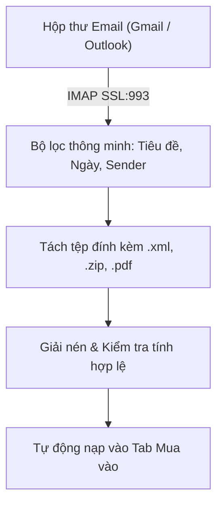

# SỔ TAY HƯỚNG DẪN SỬ DỤNG TOÀN DIỆN
## PHẦN MỀM QUẢN LÝ HÓA ĐƠN ĐIỆN TỬ (GDT DESKTOP APP)

---

## MỤC LỤC
1. [Phần 1: Giới thiệu Tổng quan & Yêu cầu Hệ thống](#phần-1-giới-thiệu-tổng-quan--yêu-cầu-hệ-thống)
2. [Phần 2: Quản lý Bản quyền & Thông tin Máy (Node-Locked License)](#phần-2-quản-lý-bản-quyền--thông-tin-máy-node-locked-license)
3. [Phần 3: Quản lý Hồ sơ Doanh nghiệp & Thư mục Lưu trữ](#phần-3-quản-lý-hồ-sơ-doanh-nghiệp--thư-mục-lưu-trữ)
4. [Phần 4: Đăng nhập & Đồng bộ Hóa đơn từ Cơ quan Thuế (GDT)](#phần-4-đăng-nhập--đồng-bộ-hóa-đơn-từ-cơ-quan-thuế-gdt)
5. [Phần 5: Quét & Nhập Hóa đơn Tự động từ Email](#phần-5-quét--nhập-hóa-đơn-tự-động-từ-email)
6. [Phần 6: Quản lý Hóa đơn Mua vào - Bán ra & Nhập liệu Kiểu Excel](#phần-6-quản-lý-hóa-đơn-mua-vào---bán-ra--nhập-liệu-kiểu-excel)
7. [Phần 7: Báo cáo Thống kê & Xuất Excel Chuẩn Kế toán](#phần-7-báo-cáo-thống-kê--xuất-excel-chuẩn-kế-toán)
8. [Phần 8: Khóa sổ Dữ liệu & Bảo vệ Kỳ Kế toán](#phần-8-khóa-sổ-dữ-liệu--bảo-vệ-kỳ-kế-toán)
9. [Phần 9: Sao lưu & Phục hồi Dữ liệu Thông minh](#phần-9-sao-lưu--phục-hồi-dữ-liệu-thông-minh)
10. [Phần 10: Xử lý Sự cố Thường gặp (FAQ & Troubleshooting)](#phần-10-xử-lý-sự-cố-thường-gặp-faq--troubleshooting)

---

## PHẦN 1: GIỚI THIỆU TỔNG QUAN & YÊU CẦU HỆ THỐNG

### 1.1. Giới thiệu phần mềm
**Phần mềm Quản Lý Hóa Đơn Điện Tử** là giải pháp máy trạm chuyên nghiệp dành cho Kế toán doanh nghiệp, Đại lý thuế và Giám đốc điều hành nhằm tự động hóa toàn bộ quy trình:
- Đồng bộ hóa đơn điện tử mua vào và bán ra trực tiếp từ Cổng Thông tin Hóa đơn điện tử của Tổng cục Thuế (`hoadondientu.gdt.gov.vn`).
- Hỗ trợ đầy đủ cả Hóa đơn thông thường và Hóa đơn khởi tạo từ Máy tính tiền (MTT / SCO).
- Tự động tải, phân loại, giải nén và lưu trữ an toàn các tệp gốc **XML** và **PDF** vào cấu trúc cây thư mục khoa học.
- Quét và trích xuất hóa đơn tự động từ hộp thư điện tử (Gmail, Outlook, Mail Server doanh nghiệp).
- Kiểm tra thông tin Công ty trên hóa đơn mua vào (Tên Công ty, Địa chỉ) và cảnh báo sai lệch.
- Cột Ghi chú cho phép người dùng tự thêm nội dung, hỗ trợ các chức năng như `Ctrl+D` trong Excel, chọn nhiều hàng + Click phải để thêm nội dung,... (Chi tiết ở [Mục 6.3](#63-tính-năng-cột-ghi-chú--nhập-liệu-hàng-loạt-kiểu-excel)).
- Đối chiếu trạng thái hoạt động Người nộp thuế (MST đối tác) với Cơ quan Thuế.
- Nhập liệu và thao tác hàng loạt kiểu Excel mượt mà, hỗ trợ ghi chú kiểm tra và khóa sổ kỳ kế toán.

### 1.2. Tính an toàn & Bảo mật ngoại tuyến (100% Offline Database)
> [!IMPORTANT]
> **Cam kết bảo mật dữ liệu tuyệt đối:**
> Toàn bộ cơ sở dữ liệu hóa đơn, hồ sơ công ty và mật khẩu đăng nhập đều được lưu trữ trực tiếp trên máy tính của bạn thông qua hệ quản trị cơ sở dữ liệu SQLite cục bộ. Phần mềm **tuyệt đối không gửi dữ liệu hóa đơn của bạn lên bất kỳ máy chủ đám mây trung gian nào bên ngoài**.

### 1.3. Yêu cầu hệ thống khuyến nghị
- **Hệ điều hành:** Windows 10, Windows 11 hoặc Windows Server 2016 trở lên (kiến trúc 64-bit).
- **Bộ vi xử lý (CPU):** Intel Core i3 / AMD Ryzen 3 trở lên (khuyến nghị Core i5).
- **Bộ nhớ RAM:** Tối thiểu 4 GB (khuyến nghị 8 GB để xử lý hàng vạn hóa đơn).
- **Dung lượng ổ đĩa:** Tối thiểu 2 GB trống (để lưu trữ tệp XML/PDF hóa đơn).
- **Mạng Internet:** Cần có kết nối Internet khi thực hiện Tra cứu CQT, Quét Email hoặc Kiểm tra NNT. Khi xem dữ liệu, làm báo cáo và xuất Excel, phần mềm hoạt động hoàn toàn Offline.

---

## PHẦN 2: QUẢN LÝ BẢN QUYỀN & THÔNG TIN MÁY (NODE-LOCKED LICENSE)

Hệ thống bản quyền được thiết kế theo cơ chế **Khóa theo phần cứng thiết bị (Node-Locked)**, xác thực bằng chữ ký số bất đối xứng công nghệ cao (Ed25519) và **hoạt động 100% không cần kết nối mạng để kiểm tra bản quyền**.


### 2.1. Dùng thử 30 ngày miễn phí
Ngay khi mở ứng dụng lần đầu tiên trên một máy tính mới, hệ thống tự động kích hoạt gói **Dùng thử 30 ngày đầy đủ tính năng**. Trên đỉnh cửa sổ chính xuất hiện thanh đếm ngược thông báo số ngày dùng thử còn lại.

### 2.2. Lấy Mã máy (Machine ID) để đăng ký bản quyền
1. Trên thanh điều hướng bên trái, bấm vào mục **"9. Cài đặt"**.
2. Tìm đến khung **"Thông tin Bản quyền & Kích hoạt"**.
3. Tại ô **"Mã máy của bạn (Machine ID)"**, bấm nút **`📋 Sao chép mã máy`** (Mã máy có dạng chuẩn `XXXX-XXXX-XXXX-XXXX`).
4. Gửi mã này cho nhà cung cấp phần mềm để nhận mã bản quyền thương mại chính thức.

### 2.3. Hướng dẫn Kích hoạt bản quyền
Người dùng có thể kích hoạt bằng 1 trong 2 hình thức:
- **Cách 1 - Nhập chuỗi mã trực tiếp:** Dán chuỗi mã bắt đầu bằng `GDTLIC-...` vào ô "Nhập mã kích hoạt" -> Bấm **`🔑 Kích hoạt bản quyền`**.
- **Cách 2 - Nạp tệp bản quyền `.lic`:** Bấm nút **`📁 Chọn file .lic...`** -> Tìm chọn tệp bản quyền nhận từ nhà cung cấp -> Bấm **`🔑 Kích hoạt bản quyền`**.

Sau khi kích hoạt thành công:
- Thẻ trạng thái chuyển sang màu xanh lá với thông điệp: *"Bản quyền thương mại hợp lệ"*.
- Banner dùng thử ở đỉnh ứng dụng tự động ẩn đi, giải phóng toàn bộ không gian làm việc.

> [!WARNING]
> **Cơ chế chống tua lùi thời gian (Anti-Clock Rollback):**
> Ứng dụng ghi nhận dấu vết thời gian chạy an toàn. Nếu người dùng cố tình chỉnh lùi giờ hệ điều hành Windows về quá khứ nhằm gian lận thời gian dùng thử, phần mềm sẽ phát hiện can thiệp và tự động khóa các tính năng nghiệp vụ. Để mở lại, chỉ cần chỉnh giờ Windows về đúng thời gian thực hiện tại.

---

## PHẦN 3: QUẢN LÝ HỒ SƠ DOANH NGHIỆP & THƯ MỤC LƯU TRỮ

Phần mềm hỗ trợ quản lý **không giới hạn số lượng công ty** trên cùng một máy trạm.

```
QUAN_LY_HOA_DON/
└── QLHD-0318999888/                   <-- Thư mục gốc theo MST Công ty
    └── 2026/                          <-- Phân loại theo Năm
        ├── 01_HOA_DON_DAU_VAO/        <-- Hóa đơn Mua vào
        │   └── Thang_06/
        │       ├── XML/               <-- Tệp XML gốc
        │       └── PDF/               <-- Bản thể hiện PDF
        └── 02_HOA_DON_DAU_RA/         <-- Hóa đơn Bán ra
            └── Thang_06/
```

### 3.1. Thêm mới hồ sơ công ty
1. Bấm vào mục **"2. Công ty"** trên thanh menu trái.
2. Bấm nút **`➕ Thêm công ty mới`** ở góc trên bên phải.
3. Điền các thông tin của doanh nghiệp:
   - **Mã số thuế (bắt buộc):** Nhập chính xác MST doanh nghiệp (ví dụ: `0318999888`).
   - **Tên doanh nghiệp:** Tên công ty đầy đủ theo giấy phép ĐKKD.
   - **Tên viết tắt:** Tên hiển thị ngắn gọn trên thanh trạng thái.
   - **Địa chỉ:** Trụ sở chính của công ty.
   - **Tài khoản CQT:** Tên đăng nhập portal Thuế (thường trùng với MST).
   - **Mật khẩu CQT:** Mật khẩu đăng nhập hệ thống Hóa đơn điện tử của Thuế.
   - **Thư mục lưu trữ hóa đơn:** Mặc định lưu tại `QUAN_LY_HOA_DON/QLHD-[MST]`. Bạn có thể bấm nút duyệt thư mục để chuyển sang ổ đĩa có dung lượng lớn hơn (ví dụ: `D:/HOA_DON_DOANH_NGHIEP`).
4. Bấm **`💾 Lưu thông tin`**.

### 3.2. Chuyển đổi công ty đang làm việc
- Tại màn hình danh sách công ty, bấm đúp vào công ty muốn thao tác, hoặc bấm nút **`🏢 Kích hoạt làm việc`**.
- Bạn cũng có thể chuyển đổi nhanh qua hộp chọn công ty trên thanh trạng thái phía dưới cùng của phần mềm. Toàn bộ các tab Mua vào, Bán ra, Báo cáo sẽ tự động nạp dữ liệu của công ty đang chọn.

---

## PHẦN 4: ĐĂNG NHẬP & ĐỒNG BỘ HÓA ĐƠN TỪ CƠ QUAN THUẾ (GDT)

### 4.1. Đăng nhập hệ thống Thuế
1. Bấm vào mục **"3. Đăng nhập"**.
2. Hệ thống sẽ tự động điền MST và mật khẩu đã lưu trong hồ sơ công ty.
3. Ứng dụng tự động tải hình ảnh mã xác thực (Captcha). Bạn chỉ cần gõ mã Captcha vào ô và bấm **`Đăng nhập`**.
4. Khi đăng nhập thành công, phần mềm lưu giữ phiên làm việc (Session Token) an toàn để sử dụng cho các tác vụ đồng bộ tiếp theo mà không cần đăng nhập lại nhiều lần.

### 4.2. Tra cứu & Đồng bộ hóa đơn tự động
1. Chuyển sang tab **"4. Hóa đơn mua vào"** hoặc **"5. Hóa đơn bán ra"**.
2. Tại thanh công cụ lọc phía trên:
   - Chọn khoảng ngày: **Từ ngày** - **Đến ngày** (không bị ràng buộc bởi chọn theo từng tháng, Người dùng có thể chọn theo khoảng thời gian tùy ý).
3. Bấm nút **`🔍 Tra cứu từ CQT`**:
   - Hệ thống tự động gửi yêu cầu phân trang lên cổng Thuế.
   - Các hóa đơn mới sẽ được thêm vào database SQLite; các hóa đơn đã có sẽ được cập nhật lại trạng thái mới nhất từ Cơ quan Thuế mà không làm mất các ghi chú riêng của bạn.

---

## PHẦN 5: QUÉT & NHẬP HÓA ĐƠN TỰ ĐỘNG TỪ EMAIL

Tính năng Quét Email giúp tự động tải hóa đơn do nhà cung cấp gửi về hộp thư điện tử của doanh nghiệp.



### 5.1. Thiết lập cấu hình Email (Tab Nhập XML -> Quét Email)
1. Bấm mục **"6. Nhập hóa đơn XML từ máy tính"**, chọn tab con **"📧 Quét Email"**.
2. Chọn nhà cung cấp email:
   - **Gmail:** Máy chủ `imap.gmail.com`, Cổng `993`, Bật SSL.
   - **Outlook / Office 365:** Máy chủ `outlook.office365.com`, Cổng `993`, Bật SSL.
   - **Mail Server riêng (Zimbra, Mdaemon, cPanel...):** Nhập địa chỉ IMAP do quản trị viên cung cấp.
3. **Địa chỉ Email:** Nhập địa chỉ hộp thư nhận hóa đơn.
4. **Mật khẩu Email:**
   > [!TIP]
   > Đối với **Gmail** hoặc **Outlook**, bạn **bắt buộc phải sử dụng Mật khẩu ứng dụng (App Password)** gồm 16 ký tự, không dùng mật khẩu đăng nhập chính:
   > - *Với Gmail:* Truy cập Tài khoản Google -> Bảo mật -> Xác minh 2 bước -> Mật khẩu ứng dụng -> Tạo mật khẩu mới cho "Mail".

5. **Bộ lọc quét email:**
   - *Từ ngày - Đến ngày:* Giới hạn thời gian email cần quét.
   - *Từ khóa tiêu đề:* Mặc định `hóa đơn, hoa don, invoice, e-invoice`.
   - *Tùy chọn "Chỉ quét thư chưa đọc":* Giúp tăng tốc độ quét cho các lần sau.
6. Bấm **`💾 Lưu cấu hình`** -> Bấm **`🔌 Kiểm tra kết nối`** để xác nhận kết nối thành công.

### 5.2. Thao tác Quét & Cơ chế Dừng quét an toàn
- **Bắt đầu quét:** Bấm nút **`📧 Quét Email ngay`**.
  - Phần mềm duyệt từng email, tự động tìm các file `.xml` hoặc `.zip` nén hóa đơn.
  - Tự động bóc tách thông tin người bán, ngày lập, tiền thuế, tiền hàng và lưu vào cơ sở dữ liệu.
- **Dừng quét an toàn (Cancel/Stop Scan):**
  - Trong quá trình quét, nếu bạn muốn dừng lại, bấm nút **`⏹️ Dừng quét`**.
  - Tiến trình sẽ dừng ngay lập tức tại email hiện tại. Toàn bộ các hóa đơn đã quét thành công trước đó vẫn được bảo toàn nguyên vẹn trong hệ thống.

---

## PHẦN 6: QUẢN LÝ HÓA ĐƠN MUA VÀO - BÁN RA & NHẬP LIỆU KIỂU EXCEL

### 6.1. Bảng dữ liệu thông minh
- **Cột ghim cố định (Frozen Columns):** Cột chọn (checkbox) và số thứ tự luôn được giữ cố định khi cuộn ngang bảng, giúp bạn không bị mất dấu dòng đang xem.
- **Sắp xếp linh hoạt:** Bấm vào tiêu đề bất kỳ cột nào để sắp xếp Tăng dần / Giảm dần (Ngày hóa đơn, Số tiền, Tên người bán...).

### 6.2. Xem chi tiết & Tải tệp vật lý
- **Xem Bản thể hiện hóa đơn:** Bấm đúp vào dòng hóa đơn (ngoại trừ cột Ghi chú và PDF) để mở cửa sổ chi tiết với đầy đủ bảng danh mục hàng hóa, đơn giá, thuế suất và chữ ký điện tử.
- **Tải tệp:**
  - Nút **`Tải XML`**: Tải tệp XML gốc từ Tổng cục Thuế.
  - Nút **`Tạo PDF từ XML`**: Xuất bản thể hiện PDF tiêu chuẩn.
  - Nút **`Tải PDF gốc`**: Tải file PDF bản thể hiện do chính nhà cung cấp phát hành (nếu có).

### 6.3. Tính năng Cột Ghi chú & Nhập liệu hàng loạt kiểu Excel

Phần mềm tích hợp cột **"Ghi chú"** (`col_user_note`) ngay cạnh cột Trạng thái CQT với trải nghiệm thao tác trực quan y hệt Microsoft Excel:

| Tính năng | Thao tác thực hiện | Mô tả nghiệp vụ |
| :--- | :--- | :--- |
| **Sửa trực tiếp trên ô (In-cell Edit)** | Click đúp hoặc ấn `Enter` vào ô Ghi chú | Gõ trực tiếp nội dung (ví dụ: *Đã duyệt thanh toán*, *Hàng kho A*...). Rời ô hoặc ấn `Enter` để lưu tự động ngầm vào SQLite. |
| **Dán dữ liệu thông minh (`Ctrl+V`)** | Copy từ Excel -> Chọn ô Ghi chú -> `Ctrl+V` | **Trường hợp 1:** Copy dải ô nhiều dòng từ Excel, dán liên tiếp xuống các dòng bên dưới.<br>**Trường hợp 2:** Copy 1 ô, bôi đen nhiều dòng trong phần mềm và ấn `Ctrl+V` để gán cho toàn bộ dòng được chọn. |
| **Sao chép xuống (`Ctrl+D`)** | Chọn vùng ô có chứa ô trên -> Ấn `Ctrl+D` | Sao chép giá trị ghi chú của ô phía trên xuống toàn bộ các dòng được bôi đen bên dưới. |
| **Điền hàng loạt qua Menu Chuột phải** | Tick chọn các dòng -> Chuột phải -> Chọn **`📝 Điền ghi chú cho các dòng đã chọn...`** | Mở hộp thoại nhập chữ một lần, hệ thống sẽ áp dụng đồng loạt cho hàng trăm hóa đơn trong chớp mắt. |

> [!NOTE]
> Thao tác điền hàng loạt được xử lý trong 1 giao dịch cơ sở dữ liệu duy nhất (SQLite Transaction), đảm bảo tốc độ tức thì cho hàng nghìn hóa đơn mà hoàn toàn không gây giật lag giao diện.

### 6.4. Tính năng "Nối lại liên kết XML" (Resync XML Paths)
Khi bạn copy dữ liệu từ máy khác sang, di chuyển thư mục lưu trữ sang ổ đĩa khác hoặc đổi tên thư mục:
- Bấm nút **`🔗 Nối lại file XML`** trên thanh công cụ.
- Hệ thống sẽ tự động quét toàn bộ thư mục trên đĩa, tự động nhận diện lại các file XML/HTML mồ côi và nối lại chính xác với hóa đơn trong bảng.

### 6.5. Kiểm tra thông tin Công ty trên hóa đơn mua vào (Tên Công ty, Địa chỉ) & Cảnh báo sai lệch
Khi bên bán xuất hóa đơn mua vào cho doanh nghiệp, thường dễ phát sinh sai sót về Tên công ty hoặc Địa chỉ (sai chính tả, thiếu phường/quận, hoặc sử dụng các từ viết tắt khác nhau). Hệ thống tích hợp cơ chế đối chiếu tự động giúp kế toán kiểm soát chặt chẽ:
- **Tự động đối chiếu thông minh:** Phần mềm tự động so sánh Tên người mua và Địa chỉ người mua trên từng hóa đơn với thông tin chuẩn trong Hồ sơ doanh nghiệp.
- **Cảnh báo trực quan:** Các hóa đơn có thông tin người mua bị sai lệch sẽ được làm nổi bật với màu sắc cảnh báo và giải thích chi tiết điểm sai lệch qua tooltip khi rê chuột vào dòng hóa đơn.
- **Nút "⚙️ Cấu hình Đối chiếu Tên/Địa chỉ":**
  - Nằm ngay trên thanh công cụ của tab Hóa đơn mua vào.
  - *Từ điển viết tắt tương đương:* Định nghĩa các từ viết tắt được công nhận (ví dụ: `TNHH` ↔ `Trách nhiệm hữu hạn`, `CP` ↔ `Cổ phần`, `TP.` ↔ `Thành phố`, `Q.` ↔ `Quận`, `P.` ↔ `Phường`...).
  - *Danh sách ngoại lệ:* Cho phép thêm các địa chỉ rút gọn hoặc biến thể đặc thù mà nhà cung cấp thường ghi để hệ thống tự động bỏ qua cảnh báo nếu thấy hợp lệ.

---

## PHẦN 7: BÁO CÁO THỐNG KÊ & XUẤT EXCEL CHUẨN KẾ TOÁN

### 7.1. Lập Báo cáo tổng hợp
1. Bấm vào mục **"7. Báo cáo"** trên thanh menu trái.
2. Thiết lập tiêu chí tổng hợp:
   - Chọn loại hóa đơn: Mua vào hoặc Bán ra.
   - Chọn kỳ báo cáo: Theo Tháng, Theo Quý hoặc Khoảng ngày tùy chọn.
3. Bấm nút **`Xem báo cáo`**:
   - Bảng báo cáo hiển thị chi tiết: Ký hiệu, Số HĐ, Ngày lập, MST đối tác, Tên đối tác, Doanh số chưa thuế, Tiền thuế VAT, Tổng thanh toán, Trạng thái CQT và **Cột Ghi chú của bạn**.

### 7.2. Tùy chỉnh cột hiển thị (Column Settings)
- Bấm nút **`Tùy chỉnh cột`** để bật/tắt các cột thông tin chuyên biệt như: Mã cơ quan thuế, Loại tiền, Tỷ giá, Thông tin hàng hóa, Chữ ký số...

### 7.3. Xuất file Excel chuẩn kế toán
- Bấm nút **`📊 Xuất Excel`**.
- File Excel được định dạng tự động chuyên nghiệp:
  - Cột số tiền căn phải, có dấu phẩy phân cách hàng nghìn.
  - Cột ngày tháng và mã số căn giữa.
  - Cột Ghi chú căn trái và bật tính năng tự động ngắt dòng (`Wrap Text`), giúp file Excel in ấn và lưu trữ thẩm mỹ tuyệt đối.

---

## PHẦN 8: KHÓA SỔ DỮ LIỆU & BẢO VỆ KỲ KẾ TOÁN

Để tránh tình trạng kế toán viên vô tình chỉnh sửa, xóa nhầm hóa đơn của các kỳ đã nộp tờ khai thuế hoặc đã quyết toán:

```
[Kỳ Kế toán Đã Khóa]
  ├── 🔒 Ngăn chặn Xóa hóa đơn
  ├── 🔒 Ngăn chặn Sửa ô Ghi chú (Chuyển sang Chế độ Chỉ đọc)
  ├── 🔒 Bỏ qua khi Paste Ctrl+V / Ctrl+D hàng loạt
  └── 🔒 Hiển thị nhãn cảnh báo ổ khóa trực quan
```

### 8.1. Cách thiết lập Khóa sổ
1. Vào mục **"9. Cài đặt"** -> Chọn nhóm **"Khóa sổ dữ liệu"**.
2. Chọn kỳ cần khóa (Ví dụ: Từ ngày `01/01/2026` đến `31/03/2026`).
3. Nhập lý do khóa sổ (ví dụ: *Đã nộp tờ khai Thuế GTGT Quý 1/2026*).
4. Bấm **`Khóa kỳ kế toán`**.

### 8.2. Cơ chế bảo vệ khi kỳ đã khóa
- Trên bảng hóa đơn, các dòng thuộc kỳ khóa sổ sẽ hiển thị biểu tượng ổ khóa 🔒.
- Ô Ghi chú của dòng đó bị vô hiệu hóa chỉnh sửa.
- Thao tác dán `Ctrl+V` hoặc điền hàng loạt sẽ tự động **bỏ qua các hóa đơn thuộc kỳ khóa sổ** và báo cáo rõ số lượng dòng được bảo vệ.

---

## PHẦN 9: SAO LƯU & PHỤC HỒI DỮ LIỆU THÔNG MINH

### 9.1. Sao lưu dữ liệu (Backup)
1. Bấm vào mục **"8. Sao lưu & Phục hồi"**, chọn tab **"Sao lưu"**.
2. Chọn phạm vi sao lưu từ ComboBox:
   - **Tất cả công ty:** Đóng gói toàn bộ cơ sở dữ liệu của tất cả doanh nghiệp trên máy.
   - **Chọn đích danh từng Công ty:** Chỉ đóng gói dữ liệu của công ty đó.
3. Bấm **`💾 Bắt đầu sao lưu`** -> Chọn nơi lưu file `.zip`.
4. Gói sao lưu bao gồm:
   - Dữ liệu hóa đơn, kỳ khóa sổ, cấu hình email (`database.json`).
   - Tệp manifest kiểm tra tính toàn vẹn (`backup_metadata.json`).
   - Toàn bộ các file vật lý XML và PDF gốc.

### 9.2. Phục hồi dữ liệu thông minh (Intelligent Restore)
1. Trong tab **"Phục hồi"**, bấm nút **`📁 Chọn file sao lưu (.zip)`**.
2. Phần mềm tự động đọc và phân tích metadata của tệp zip:
   - **Nếu công ty ĐÃ CÓ trong máy:** Hệ thống hiện thông báo xác nhận cập nhật dữ liệu vào công ty đó.
   - **Nếu công ty CHƯA CÓ trên máy:** Hệ thống tự động phát hiện và tạo mới hồ sơ công ty với đầy đủ MST, tên, username...
3. **Chọn thư mục lưu trữ đích (Target Directory):**
   - Hộp thoại xuất hiện cho phép bạn chỉ định thư mục lưu trữ hóa đơn trên máy mới (ví dụ: `D:/QUAN_LY_HOA_DON`).
   - Hệ thống tự động chuẩn hóa đường dẫn, giải nén toàn bộ tệp XML/PDF vào đúng cấu trúc năm/tháng mà không bao giờ bị lặp thư mục.
4. Khi phục hồi xong, phần mềm sẽ hỏi bạn có muốn chuyển sang làm việc tại công ty vừa phục hồi ngay bây giờ không.

---

## PHẦN 10: XỬ LÝ SỰ CỐ THƯỜNG GẶP (FAQ & TROUBLESHOOTING)

### Q1: Khi mở chi tiết hóa đơn thì hiện thông báo "Hóa đơn này chưa được tải XML"?
- **Nguyên nhân:** Hóa đơn mới chỉ được đồng bộ dữ liệu vắn tắt từ danh sách CQT hoặc tệp XML bị di chuyển.
- **Cách xử lý:**
  1. Tick chọn hóa đơn đó và bấm nút **`Tải XML`** trên thanh công cụ.
  2. Nếu bạn vừa chuyển dữ liệu từ máy khác sang, hãy bấm nút **`🔗 Nối lại file XML`** để ứng dụng tự động kết nối lại file trên đĩa.

### Q2: Kiểm tra kết nối Email báo lỗi "Authentication Failed" hoặc không kết nối được?
- **Cách xử lý:**
  - Đảm bảo bạn đang sử dụng **Mật khẩu ứng dụng (App Password)** gồm 16 chữ cái, không phải mật khẩu hộp thư thông thường.
  - Kiểm tra cổng kết nối IMAP là `993` và đã tích chọn **Sử dụng SSL**.

### Q3: Ứng dụng báo lỗi "Phát hiện thời gian hệ thống bị chỉnh lùi"?
- **Cách xử lý:**
  - Nhấp chuột phải vào đồng hồ ở góc dưới bên phải màn hình Windows -> Chọn **Adjust date/time**.
  - Bật tính năng **Set time automatically** (Đặt thời gian tự động) và chọn đúng múi giờ **(UTC+07:00) Bangkok, Hanoi, Jakarta**.
  - Khởi động lại ứng dụng.

### Q4: Làm thế nào để chuyển toàn bộ phần mềm sang máy tính mới?
1. Tại máy tính cũ: Thực hiện **Sao lưu toàn bộ** ra một file `.zip`.
2. Copy file `.zip` sang máy tính mới (bằng USB hoặc mạng nội bộ).
3. Tại máy tính mới: Cài đặt phần mềm, vào tab **Sao lưu & Phục hồi** -> Chọn **Phục hồi** từ file `.zip`.
4. Vào tab **Cài đặt** trên máy mới, sao chép **Machine ID mới** và gửi cho nhà cung cấp để nhận mã kích hoạt bản quyền cho máy mới.

---
*Tài liệu được cập nhật và biên soạn chính thức cho Phần mềm Quản Lý Hóa Đơn Điện Tử phiên bản 2.0.*
*Chúc Quý Doanh nghiệp và Quý Kế toán viên có trải nghiệm làm việc hiệu quả và tiện lợi nhất!*
